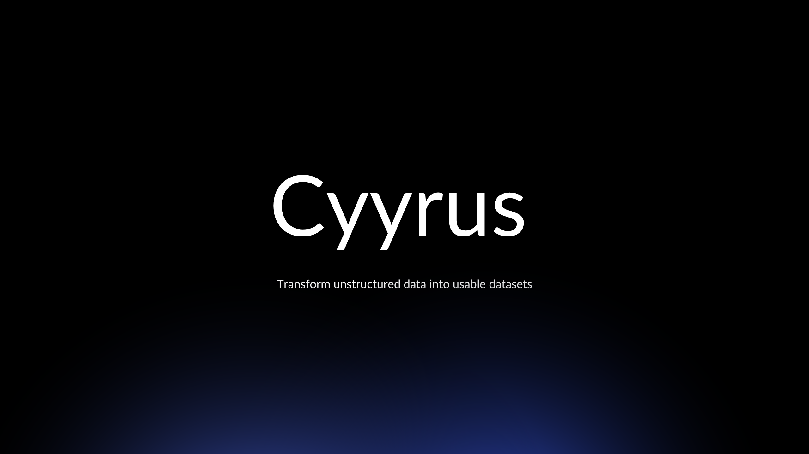

## Why
World has plenty of data, but most of it is trapped in formats that are difficult to utilize. We’re talking about messy relational databases, unstructured text, audio, video, even the latent space of LLMs. It's not a goldmine; it's a landfill. And we're spending millions trying to clean it up.

## Introducting Cyyrus
DataOps today looks a mix of ClickOps, CryOps and PrayOps. What if it didn't had to? Cyyrus aims to do for datasets, what Terraform did for Infrastructure.

Cyyrus does't make assumptions about your data because we don't have to. It handles it all, in all its messy, unstructured glory.

Sure but doesn't X do this already? The market is saturated with products but these tools don't solve data silos; they create new ones. Cyyrus doesn't bundle an analytics product, charging for transformations and checkpoints, not data storage so it benefits with data movement.

## Components

Current tooling around running evaluation, performing finetuning are broken. They are built by optimists, dreamers, and in many cases, brilliant engineers. But they're building tools for a world that doesn't exist - a world where data comes pre-cleaned, perfectly labeled, and ready for AI consumption.

Data is unstructured and messy. These $10/month tools? They're useless for 80% of your data. Sure, the tool costs $10/month. But what about the army of data scientist you need to make your data "tool-ready”.

Cyyrus plans to introduce components which makes existing tools "data-ready". Think `react.email` for last mile data transformation.

## Feedback

We're here to give developers what they really need, not what looks good in a TechCrunch headline. We've been there. We've felt the pain, and yes, we've even built some of those well-intentioned but ultimately inadequate tools ourselves. Now, we're channeling that into building Cyyrus.

## Footnote

The current Cyyrus package is experimental and built over the weekend to understand if terraforming data ops is viable. Does our approach resonate with you? ? Or do you think we're completely off base?

Don't hold back - we love to talk, and more importantly, we love to listen. [Lessgo](mailto:cyyruslabs@gmail.com).