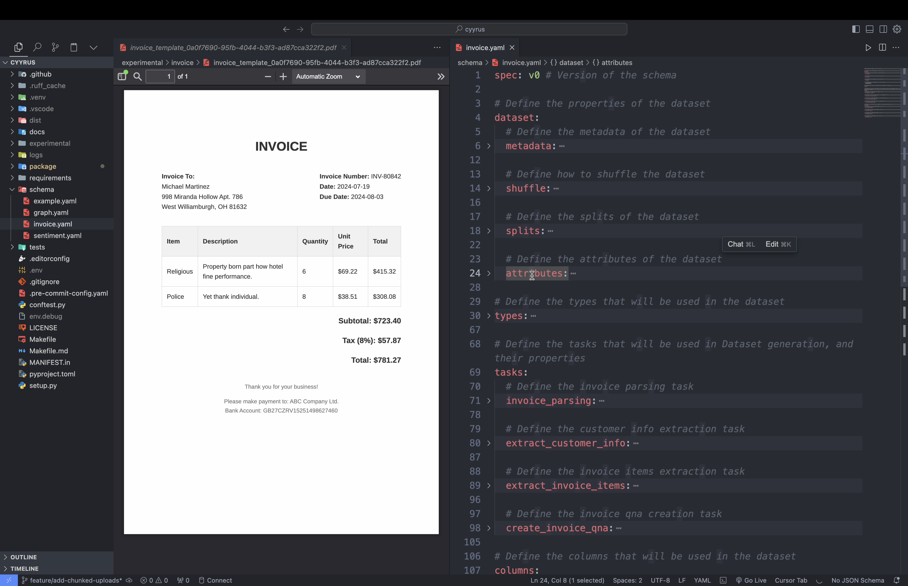
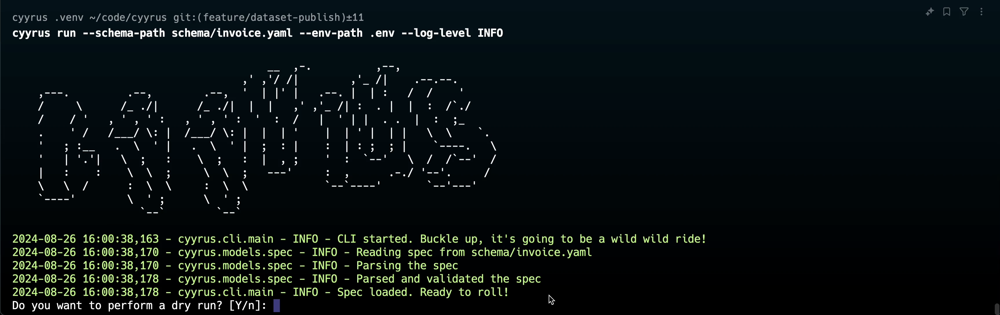
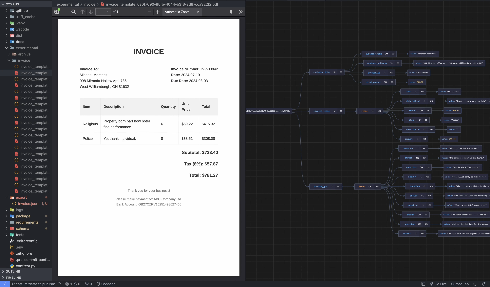

🚧🚨 Please note that Cyyrus is currently in active development as we prepare for its public release 🚧🚨

## Why
World has plenty of data, but most of it is trapped in formats that are difficult to utilize. We’re talking about messy relational databases, unstructured text, audio, video, even the latent space of LLMs. It's not a goldmine; it's a landfill. And we're spending millions trying to clean it up.

## Introducting Cyyrus
DataOps today looks a mix of `ClickOps`, `CryOps` and `PrayOps`. What if it didn't had to?

`Cyyrus` aims to do for datasets, what `Terraform` did for Infrastructure.

Cyyrus does't make assumptions about your data because we don't have to. It handles it all, in all its messy, unstructured glory.

Sure but doesn't X do this already? The market is saturated with products but these tools don't solve data silos; they create new ones.

Cyyrus doesn't bundle an analytics product, it charges for transformations and checkpoints, not data storage so it benefits with data movement.

## Quick Start

We built Cyyrus so that it doesn’t need a manual to operate, but here’s one anyway. Let's get you upto speed. You'd be a pro in no time.

### Installation

Alright, baby steps. Install Cyyrus with `pip`:

```bash
pip install cyyrus
```

### Configuration

With Cyyrus, you can configure your schema using a simple YAML file. This YAML defines the structure, properties, and types of the dataset. Think of it as poor man's HCL.

1. **Define Your Tasks**: First step is to define the tasks that will be used in the dataset generation process. These tasks can include parsing, extraction, or something else.
    ```yaml
    tasks:
        # Define the invoice parsing task
        invoice_parsing:
            task_type: parsing
            task_properties:
                directory: experimental/sample
                file_type: pdf
                max_depth: 5
                parsed_format: base64

        # Define the customer info extraction task
        extract_customer_info:
            task_type: generation
            task_properties:
                model: gpt-4o-mini
                prompt: Extract customer info from the given invoice
                response_format: customer_info
                api_key: $OPENAI_API_KEY

    ```
2. **Define Your Types**: Once the tasks are defined, the next step is to define the types that will be used in the dataset. These types can include objects, arrays, or any other data type.
    ```yaml
    types:
        customer_info:
            type: object
            properties:
                customer_name:
                    type: string  # What do we call this hooman?
                customer_address:
                    type: string  # Where do we find them?
                invoice_id:
                    type: string  # The unique identifier for their financial pain
                total_amount:
                    type: float   # How much do they owe us for our digital crack?

    ```
3. **Define Your Columns**: Columns are the attributes of the dataset.
    ```yaml
    columns:
        # Define the parsed invoice column
        parsed_invoice:
            task_id: invoice_parsing # Associate a task_id with the column

        # Define the customer info column
        customer_info:
            task_id: extract_customer_info
            task_input: [parsed_invoice]
            # Define the input for the task.

        # Define the invoice items column
        invoice_items:
            task_id: extract_invoice_items
            task_input: [parsed_invoice]

        # Define the invoice qna column
        invoice_qna:
            task_id: create_invoice_qna
            task_input: [invoice_items, customer_info]
            # Ensures the task is executed after the task_input is available
    ```
4. **Define Your Datasets**: Datasets are defined by the metadata, splits, attributes, and shuffle properties.
    ```yaml
        # Define the properties of the dataset
    dataset:
        # Define the metadata of the dataset
        metadata:
            name: Invoice Dataset
            description: Dataset containing the invoice data
            tags: [invoice, financial, document]
            license: CC-BY-NC-SA
            languages: [en]

        # Define how to shuffle the dataset
        shuffle:
            seed: 42

        # Define the splits of the dataset
        splits:
            train: 0.8
            test: 0.2
            seed: 42

        # Define the attributes of the dataset
        attributes:
            required_columns: [invoice_items, customer_info]
            unique_columns: []
            flatten_columns: [invoice_items, invoice_qna]
            exclude_columns: [parsed_invoice]
            nulls: include
    ```

    

### Generation
Now comes the exciting part. With our schema in place, we’re ready to generate data.

```bash
cyrus run --schema-path path/to/your/schema.yaml --env-path path/to/your/.env
```



Cyrus processes each column defined in your schema, handling dependencies, types, error cases, and one-to-many mappings. You’ll see progress bars and logs for each step:

```
2024-08-26 16:01:14,096 - cyrus.composer.core - INFO - Preparing column: parsed_invoice
2024-08-26 16:01:14,097 - cyrus.composer.core - INFO - Executing task: TaskType.PARSING
100%|█████████████████████████████████████████████████| 1/1 [00:08<00:00,  8.09s/it]
2024-08-26 16:01:22,191 - cyrus.composer.core - INFO - Preparing column: customer_info
2024-08-26 16:01:22,191 - cyrus.composer.core - INFO - Executing task: TaskType.GENERATION
100%|█████████████████████████████████████████████████| 11/11 [00:44<00:00,  4.03s/it]
...
```

### Preview

And just like that you unf*ucked unstructured data. Pretty, ain't it?




### Exports

But we’re not done yet! After generation, you’ll have the option to export your dataset:

```
Ready to export the dataset? [y/N]: y
Enter the export directory [/Users/Code/cyrus]: export
Enter the export format (huggingface, json, csv, pickle, parquet) [huggingface]: json
Enter a name for your dataset (How about: Pierce_Macadamia ?) [Pierce_Macadamia]: invoice
```

Choose your flavor - JSON, CSV, pickle, parquet - Cyrus has got you covered.

### Publishing

Cyrus is best buddies with Hugging Face, and it’s ready to help you publish your dataset.

```
Do you want to publish the dataset? [Y/N]: y
HF TOKEN found in environment. Use 'hf_PT...NFTJu'? [Y/N]: y
Enter the repository identifier: wizenheimer/invoice-dataset
Keep the dataset private? [Y/N]: y
```
Cyrus handles the upload process, creating the necessary formats and uploading to Hugging Face:

```
2024-08-26 16:05:35,604 - cyrus.composer.core - INFO - Publishing dataset to Hugging Face: wizenheimer/invoice-dataset
Creating parquet from Arrow format: 100%|████████████████| 1/1 [00:00<00:00, 152.07ba/s]
Uploading the dataset shards: 100%|███████████████████| 1/1 [00:03<00:00,  3.04s/it]
Creating parquet from Arrow format: 100%|████████████████| 1/1 [00:00<00:00, 255.36ba/s]
Uploading the dataset shards: 100%|███████████████████| 1/1 [00:01<00:00,  1.60s/it]
2024-08-26 16:05:42,223 - cyrus.composer.core - INFO - Dataset successfully published to wizenheimer/invoice-dataset
2024-08-26 16:05:42,224 - cyrus.cli.main - INFO - Published dataset to None. Happy sharing!
2024-08-26 16:05:42,224 - cyrus.cli.main - INFO - Dataset published successfully!
```

And there you have it, folks! your dataset is generated, exported, and published to Hugging Face

## Documentation

We've put together a neat documentation. Check out [docs](https://cyyrus.com/introduction).

## Feedback

We're here to give developers what they really need, not what looks good in a TechCrunch headline. We've been there. We've felt the pain, and yes, we've even built some of those well-intentioned but ultimately inadequate tools ourselves. Now, we're channeling that into building Cyyrus.

The current Cyyrus package is experimental and built over the weekend to understand if terraforming data ops is viable. Does our approach resonate with you? ? Or do you think we're completely off base?

Don't hold back - we love to talk, and more importantly, we love to listen. [Lessgo](mailto:cyyruslabs@gmail.com).

## Contributing

Wanna lend us a hand? Great! There are many ways you can make Cyyrus awesome.

1. **Improving the docs**: Got a knack for explaining stuff? This is your time to shine! Everything is written in [Markdown] to facilitate the process of contributing.
2. **Implementing new tasks**: Wanna see a new Task? We’re all ears! We love expanding Cyyrus to cover as many use cases as possible.
3. **Callout our flaws**: Spotted a Bug? Awesome. Make some noise. Help us notice. Tell us all about it! What happened? What did you expect to happen instead?
4. **Rev us up**: Got a Feature Idea? Awesome! Tell us all about it! Paint us a picture, why it’s useful, and how you think it should work.

Head over to contributor's [guide](https://cyyrus.com/overview/contributing) to know how to get started. We absolutely love pull requests!


## Adjacent Work

Current tooling around running evaluation, performing finetuning are broken. They are built by optimists, dreamers, and in many cases, brilliant engineers. But they're building tools for a world that doesn't exist - a world where data comes pre-cleaned, perfectly labeled, and ready for AI consumption.

Data is unstructured and messy. These $10/month tools? They're useless for 80% of your data. Sure, the tool costs $10/month. But what about the army of data scientist you need to make your data "tool-ready”.

Cyyrus plans to introduce components which makes existing tools "data-ready". Think `react.email` for last mile data transformation.

## Credits

Created by engineers who have an irrational belief that data transformation doesn't need to be a clusterfuck as it is today.

Terraform made infrastructure sexy. They believe a tool like Cyyrus can make data transformation sexy as well. With their half built, barely functional MVP, they're curious if they can make others believe as well.